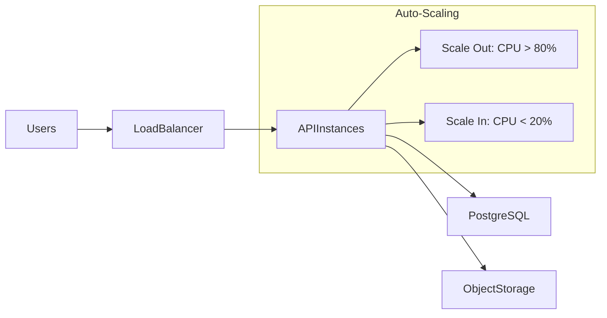

# TAMS Oracle Cloud Infrastructure (OCI) Deployment

Television Archive Management System (TAMS) infrastructure deployment for Oracle Cloud, designed to modernize broadcast media archives management by migrating from tape storage to cloud-based solutions.

## 🎯 Project Overview

This Terraform configuration deploys a complete TAMS infrastructure on Oracle Cloud Infrastructure, providing:

- **Scalable Object Storage**: Multi-tier storage strategy for 5-minute media chunks
- **PostgreSQL Database**: Open-source database for TAMS metadata
- **Auto-scaling API Infrastructure**: Load-balanced compute instances with automatic scaling
- **Secure Networking**: VCN with public/private subnet isolation
- **Automated Backups**: Scheduled database and volume backups

## 📁 Project Structure

```
tams-oci/
├── terraform/                 # Terraform configuration files
│   ├── versions.tf           # Provider version constraints
│   ├── provider.tf           # OCI provider configuration
│   ├── variables.tf          # Input variables
│   ├── data.tf              # Data sources
│   ├── network.tf           # VCN and networking resources
│   ├── storage.tf           # Object storage buckets
│   ├── database.tf          # PostgreSQL database instance
│   ├── compute.tf           # API compute instances
│   └── outputs.tf           # Output values
├── scripts/                  # Automation scripts
│   ├── init_postgresql.sh   # Database initialization
│   └── init_tams_api.sh     # API server setup
├── docs/                     # Documentation
│   ├── architecture.md      # Architecture diagrams and details
│   └── deployment-guide.md  # Step-by-step deployment guide
├── certs/                    # SSL certificates directory
└── terraform.tfvars.example  # Example variables file
```

## 🚀 Quick Start

### Prerequisites

1. OCI account with appropriate permissions
2. Terraform >= 1.0
3. OCI CLI configured
4. SSH key pair generated
5. SSL certificates (or generate self-signed)

### Deployment Steps

```bash
# 1. Clone repository
git clone <repository-url>
cd tams-oci

# 2. Configure variables
cp terraform.tfvars.example terraform.tfvars
# Edit terraform.tfvars with your OCI credentials

# 3. Initialize Terraform
terraform init

# 4. Review planned changes
terraform plan

# 5. Deploy infrastructure
terraform apply
```

## 🏗️ Infrastructure Components

### Storage Architecture
- **Media Bucket**: Standard tier for active media chunks (7-year retention)
- **Archive Bucket**: Archive tier for long-term storage (10-year retention)
- **Temp Bucket**: Temporary processing storage (7-day lifecycle)

### Compute Resources
- **API Instances**: Auto-scaling pool (2-10 instances)
- **Database Server**: PostgreSQL 14 with 500GB storage
- **Load Balancer**: HTTPS termination and traffic distribution

### Network Security
- **VCN**: 10.0.0.0/16 CIDR block
- **Public Subnet**: Load balancer and bastion access
- **Private Subnet**: API instances
- **Database Subnet**: Isolated database tier

## 📊 Architecture Highlights



## 🔐 Security Features

- Network isolation with private subnets
- SSL/TLS termination at load balancer
- IAM policies for fine-grained access control
- Automated backup with retention policies
- Object versioning and encryption at rest

## 📈 Monitoring & Maintenance

- Health checks every 5 minutes
- Automated database backups at 2 AM UTC
- Log aggregation in `/var/log/tams/`
- CPU-based auto-scaling policies

## 💰 Cost Optimization

- Archive tier for infrequent access
- Auto-tiering policies
- Lifecycle rules for temporary data
- Flexible compute shapes

## 📝 Configuration Variables

| Variable | Description | Default |
|----------|-------------|---------|
| `region` | OCI region | us-phoenix-1 |
| `instance_shape` | Compute shape | VM.Standard.E4.Flex |
| `instance_ocpus` | OCPUs per instance | 2 |
| `instance_memory_in_gbs` | Memory per instance | 16 |
| `api_instance_count` | Initial API instances | 2 |
| `db_version` | PostgreSQL version | 14 |

## 🛠️ Maintenance Commands

```bash
# Check deployment status
terraform output

# Scale API instances
terraform apply -var="api_instance_count=5"

# Destroy infrastructure
terraform destroy
```

## 📚 Documentation

- [Architecture Overview](docs/architecture.md) - Detailed architecture diagrams and explanations
- [Deployment Guide](docs/deployment-guide.md) - Step-by-step deployment instructions

## 🤝 Contributing

Please read our contributing guidelines before submitting pull requests.

## 📄 License

This project is licensed under the terms specified in the LICENSE file.

## 🆘 Support

For issues and questions:
- Check the [troubleshooting section](docs/deployment-guide.md#troubleshooting)
- Review the [architecture documentation](docs/architecture.md)
- Open an issue in the repository

## 🎬 About TAMS

TAMS (Television Archive Management System) is designed to modernize broadcast media archive management, enabling cloud migration for media assets currently stored on physical tapes in Media & Entertainment company warehouses.
