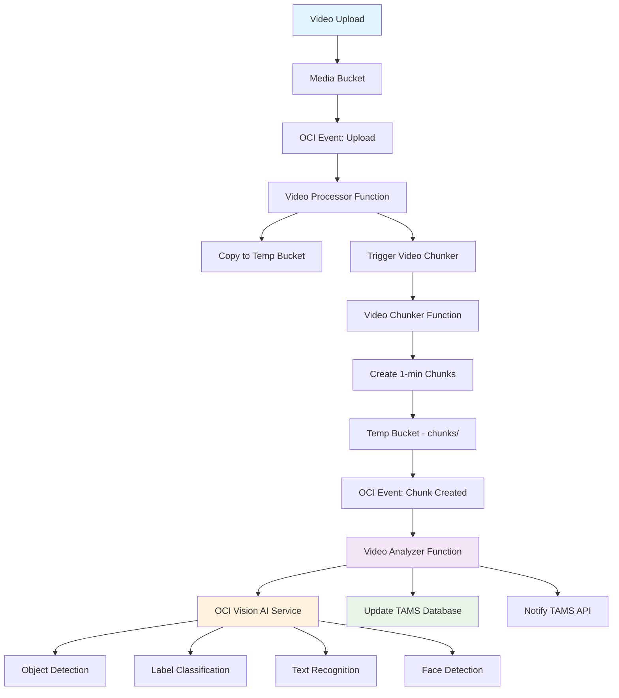
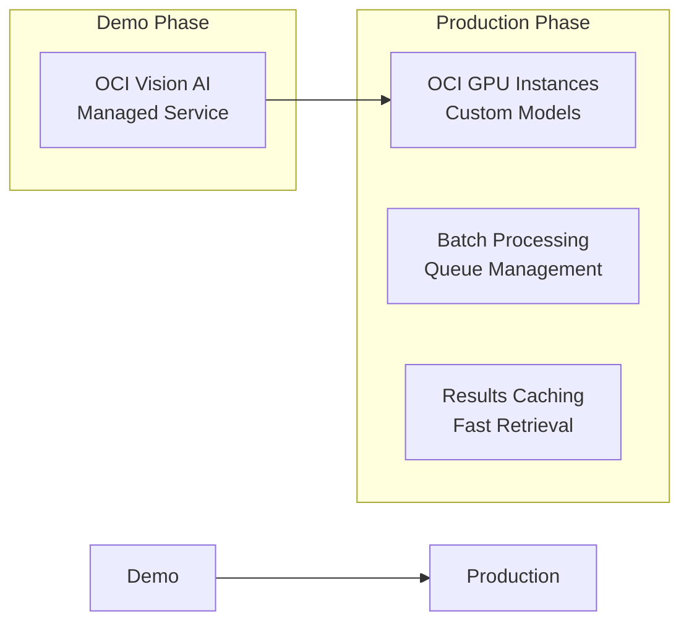

# AI-Powered Video Analysis for TAMS

## Overview

TAMS integrates Oracle Cloud Infrastructure (OCI) Vision AI to automatically analyze video chunks and extract intelligent metadata, enabling powerful search and discovery capabilities for broadcast archives.

## Complete AI Pipeline



## AI Analysis Capabilities

### OCI Vision AI Features

| Feature | Description | Use Case | Confidence Score |
|---------|-------------|----------|-----------------|
| **Object Detection** | Identifies objects with bounding boxes | Find cars, people, equipment | 85-95% |
| **Label Classification** | Categorizes content scenes | Sports, news, documentary | 90-98% |
| **Text Recognition (OCR)** | Extracts text from video frames | Titles, captions, signage | 88-95% |
| **Face Detection** | Locates faces with landmarks | People identification | 92-99% |

### Analysis Output Structure

```json
{
  "chunk_id": "archive_tape_001_chunk_001",
  "asset_id": "archive_tape_001",
  "analysis": {
    "objects": [
      {
        "name": "person",
        "confidence": 0.95,
        "bounding_box": {
          "left": 0.2, "top": 0.1,
          "width": 0.3, "height": 0.8
        },
        "timestamp": 15.5,
        "frame_index": 465
      }
    ],
    "labels": [
      {
        "name": "news_studio",
        "confidence": 0.92,
        "timestamp": 0.0,
        "category": "environment"
      }
    ],
    "text": [
      {
        "text": "BREAKING NEWS",
        "confidence": 0.88,
        "bounding_box": {...},
        "timestamp": 5.2
      }
    ],
    "faces": [
      {
        "confidence": 0.97,
        "bounding_box": {...},
        "timestamp": 12.3,
        "landmarks": [
          {"type": "left_eye", "x": 0.25, "y": 0.3}
        ]
      }
    ],
    "summary": {
      "object_count": 15,
      "label_count": 8,
      "text_count": 3,
      "face_count": 2,
      "top_objects": ["person", "microphone", "desk"],
      "top_labels": ["news_studio", "interview", "broadcast"],
      "content_type": "news",
      "scene_complexity": "medium"
    },
    "timeline": [
      {
        "timestamp": 0.0,
        "event_type": "scene_start",
        "description": "News studio scene begins",
        "confidence": 0.92
      }
    ]
  }
}
```

## Implementation Options

### Option 1: OCI Vision AI (Recommended for Demo)

**Advantages:**
- ✅ **Managed Service** - No infrastructure setup
- ✅ **Pre-trained Models** - Works immediately 
- ✅ **High Accuracy** - Enterprise-grade AI
- ✅ **Cost-effective** - Pay per analysis
- ✅ **OCI Native** - Seamless integration

**Specifications:**
- Supports MP4, MOV, MKV, WebM
- Up to 20GB files, 10 hours duration
- 50 minutes processing per workflow
- Timeline navigation with frame precision

### Option 2: Open Source YOLO + OpenCV

**For Custom Training:**
```python
# YOLO11 implementation
from ultralytics import YOLO

# Load pre-trained model
model = YOLO('yolo11n.pt')

# Analyze video chunks
results = model.track(
    source='chunk_001.mp4',
    save=True,
    tracker='bytetrack.yaml',
    classes=[0, 32, 67]  # person, sports ball, cell phone
)

# Extract frame-by-frame data
for r in results:
    frame_data = {
        'timestamp': r.frame_time,
        'objects': [
            {
                'name': model.names[int(box.cls)],
                'confidence': float(box.conf),
                'bbox': box.xyxy.tolist()
            }
            for box in r.boxes
        ]
    }
```

**Benefits:**
- 🎯 **Custom Models** - Train on broadcast content
- ⚡ **150 FPS** processing speed
- 🏷️ **80+ Object Classes** built-in
- 🔄 **Real-time Tracking** across frames

### Option 3: OCI GPU Instances + Custom AI

**For High-Scale Processing:**
```yaml
# OCI GPU Configuration
instance_shape: "BM.GPU.H100.8"
gpu_count: 8
gpu_memory: "640GB" # 8x 80GB H100 GPUs
processing_speed: "27,000 tokens/sec"
cost_optimization: "30x faster than A100"
```

**Use Cases:**
- Processing thousands of hours
- Custom model training
- Real-time live stream analysis
- Advanced scene understanding

## Database Schema for AI Tags

```sql
-- Video analysis results table
CREATE TABLE video_analysis (
    id SERIAL PRIMARY KEY,
    chunk_id VARCHAR(255) NOT NULL,
    asset_id VARCHAR(255) NOT NULL,
    analysis_type VARCHAR(50) DEFAULT 'oci_vision',
    created_at TIMESTAMP DEFAULT NOW(),
    
    -- Analysis summary
    object_count INTEGER DEFAULT 0,
    label_count INTEGER DEFAULT 0,
    text_count INTEGER DEFAULT 0,
    face_count INTEGER DEFAULT 0,
    content_type VARCHAR(50),
    scene_complexity VARCHAR(20),
    
    -- Raw analysis data
    analysis_data JSONB,
    
    FOREIGN KEY (chunk_id) REFERENCES chunks(chunk_id),
    FOREIGN KEY (asset_id) REFERENCES assets(asset_id)
);

-- Detected objects table
CREATE TABLE detected_objects (
    id SERIAL PRIMARY KEY,
    analysis_id INTEGER REFERENCES video_analysis(id),
    object_name VARCHAR(100) NOT NULL,
    confidence DECIMAL(4,3) NOT NULL,
    timestamp_seconds DECIMAL(10,3) NOT NULL,
    frame_index INTEGER,
    
    -- Bounding box coordinates (normalized 0-1)
    bbox_left DECIMAL(8,6),
    bbox_top DECIMAL(8,6),
    bbox_width DECIMAL(8,6),
    bbox_height DECIMAL(8,6),
    
    created_at TIMESTAMP DEFAULT NOW()
);

-- Content labels table
CREATE TABLE content_labels (
    id SERIAL PRIMARY KEY,
    analysis_id INTEGER REFERENCES video_analysis(id),
    label_name VARCHAR(100) NOT NULL,
    confidence DECIMAL(4,3) NOT NULL,
    category VARCHAR(50),
    timestamp_seconds DECIMAL(10,3),
    created_at TIMESTAMP DEFAULT NOW()
);

-- Detected text table
CREATE TABLE detected_text (
    id SERIAL PRIMARY KEY,
    analysis_id INTEGER REFERENCES video_analysis(id),
    text_content TEXT NOT NULL,
    confidence DECIMAL(4,3) NOT NULL,
    timestamp_seconds DECIMAL(10,3) NOT NULL,
    
    -- Bounding box for text location
    bbox_left DECIMAL(8,6),
    bbox_top DECIMAL(8,6),
    bbox_width DECIMAL(8,6),
    bbox_height DECIMAL(8,6),
    
    created_at TIMESTAMP DEFAULT NOW()
);

-- Indexes for performance
CREATE INDEX idx_video_analysis_chunk_id ON video_analysis(chunk_id);
CREATE INDEX idx_video_analysis_asset_id ON video_analysis(asset_id);
CREATE INDEX idx_detected_objects_name ON detected_objects(object_name);
CREATE INDEX idx_content_labels_name ON content_labels(label_name);
CREATE INDEX idx_detected_text_content ON detected_text USING gin(to_tsvector('english', text_content));
```

## Search and Discovery Features

### Intelligent Search Queries

```sql
-- Find all videos containing "breaking news"
SELECT DISTINCT a.title, a.asset_id, dt.timestamp_seconds
FROM assets a
JOIN video_analysis va ON a.asset_id = va.asset_id
JOIN detected_text dt ON va.id = dt.analysis_id
WHERE dt.text_content ILIKE '%breaking news%'
ORDER BY a.created_at DESC;

-- Find all sports content with people
SELECT a.title, va.content_type, COUNT(do.id) as person_count
FROM assets a
JOIN video_analysis va ON a.asset_id = va.asset_id
JOIN detected_objects do ON va.id = do.analysis_id
WHERE va.content_type = 'sports'
AND do.object_name = 'person'
GROUP BY a.asset_id, a.title, va.content_type
HAVING COUNT(do.id) > 5
ORDER BY person_count DESC;

-- Timeline search - find specific moments
SELECT a.title, c.chunk_id, do.timestamp_seconds, do.object_name
FROM assets a
JOIN chunks c ON a.asset_id = c.asset_id
JOIN video_analysis va ON c.chunk_id = va.chunk_id
JOIN detected_objects do ON va.id = do.analysis_id
WHERE do.object_name IN ('microphone', 'camera')
AND do.confidence > 0.8
ORDER BY a.created_at DESC, do.timestamp_seconds ASC;
```

### Web UI Integration

```javascript
// Enhanced search in TAMS Web UI
async function searchWithAI() {
    const query = {
        text: "breaking news",
        objects: ["person", "microphone"],
        content_type: "news",
        confidence_threshold: 0.85,
        date_range: {
            start: "2024-01-01",
            end: "2024-12-31"
        }
    };

    const response = await fetch('/api/v1/search/ai', {
        method: 'POST',
        headers: { 'Content-Type': 'application/json' },
        body: JSON.stringify(query)
    });

    const results = await response.json();
    displaySearchResults(results);
}

function displaySearchResults(results) {
    results.matches.forEach(match => {
        // Show thumbnail at specific timestamp
        const thumbnail = generateThumbnail(match.chunk_id, match.timestamp);
        
        // Display with AI confidence indicators
        const confidence = match.confidence > 0.9 ? 'high' : 
                          match.confidence > 0.7 ? 'medium' : 'low';
        
        // Create clickable timeline
        const timeline = createTimelineView(match.detections);
    });
}
```

## Performance and Scaling

### Processing Metrics

| Metric | OCI Vision | YOLO11 | OCI GPU H100 |
|--------|------------|--------|--------------|
| **Analysis Time** | 30-60 sec/min | 4-8 sec/min | 1-2 sec/min |
| **Accuracy** | 90-95% | 85-92% | 95-98% |
| **Cost per Hour** | $2-5 | $0.10 | $30-50 |
| **Setup Complexity** | Low | Medium | High |
| **Custom Training** | No | Yes | Yes |

### Scaling Strategy



## Cost Analysis

### Monthly Processing Costs (1000 hours video)

```
OCI Vision AI:
- Processing: $500-1200
- Storage: $50
- Functions: $20
Total: $570-1270

Open Source YOLO:
- Compute (GPU): $200-400
- Storage: $50
- Development: $2000 (one-time)
Total: $250-450/month + setup

OCI GPU H100:
- Instance costs: $3000-5000
- Storage: $50
- Ultra-fast processing
Total: $3050-5050/month
```

## Deployment Instructions

### 1. Enable OCI Vision Service
```bash
# Enable Vision service in compartment
oci iam policy create \
  --compartment-id $COMPARTMENT_ID \
  --name vision-policy \
  --statements '["Allow dynamic-group functions-dg to use ai-service-vision-family in compartment id '"$COMPARTMENT_ID"'"]'
```

### 2. Deploy Video Analyzer Function
```bash
cd functions/video-analyzer
fn deploy --app tams-functions-app
```

### 3. Test Analysis Pipeline
```bash
# Upload test video
oci os object put \
  --bucket-name tams-media-production \
  --file test-news-segment.mp4

# Monitor analysis results
fn logs get tams-functions-app video-analyzer
```

### 4. Query Analysis Results
```bash
# Check database for AI tags
psql -h $DB_HOST -U tamsapi -d tamsdb \
  -c "SELECT object_name, COUNT(*) FROM detected_objects GROUP BY object_name;"
```

This AI integration transforms TAMS from a simple storage system into an **intelligent media discovery platform**, enabling broadcasters to find specific moments, people, and content across decades of archived material! 🎬🤖