# TAMS Oracle Cloud Infrastructure Architecture

## Overview

The TAMS (Television Archive Management System) infrastructure on Oracle Cloud Infrastructure (OCI) is designed to provide a scalable, secure, and highly available platform for managing broadcast media archives.

## Architecture Diagram

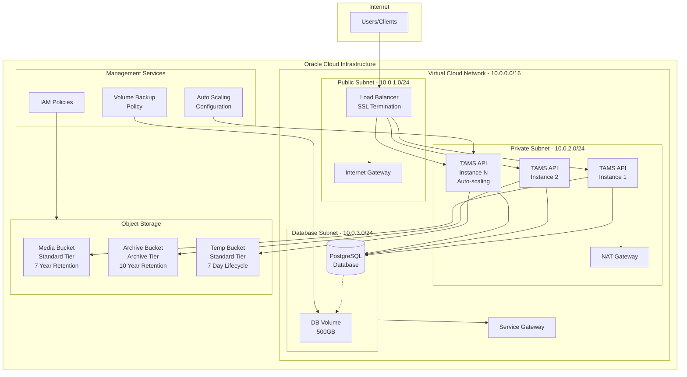

## Network Architecture

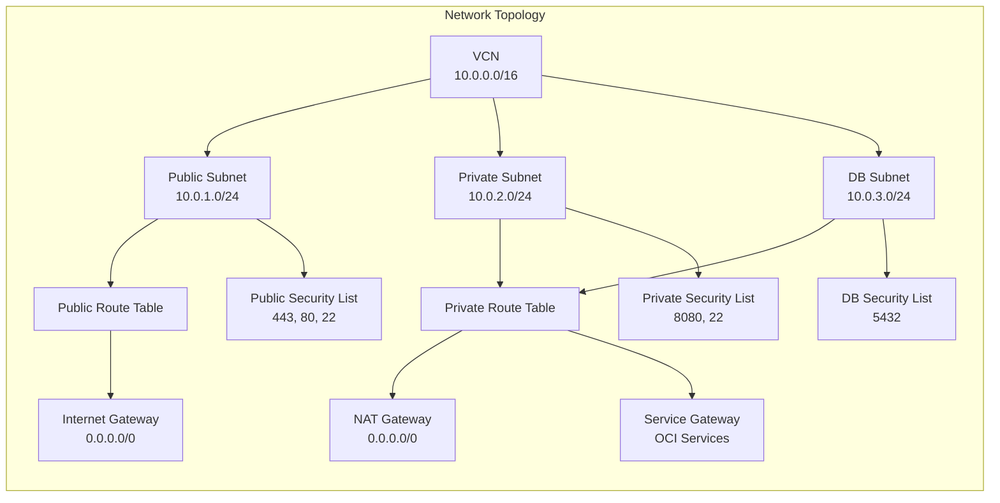

## Data Flow Diagram

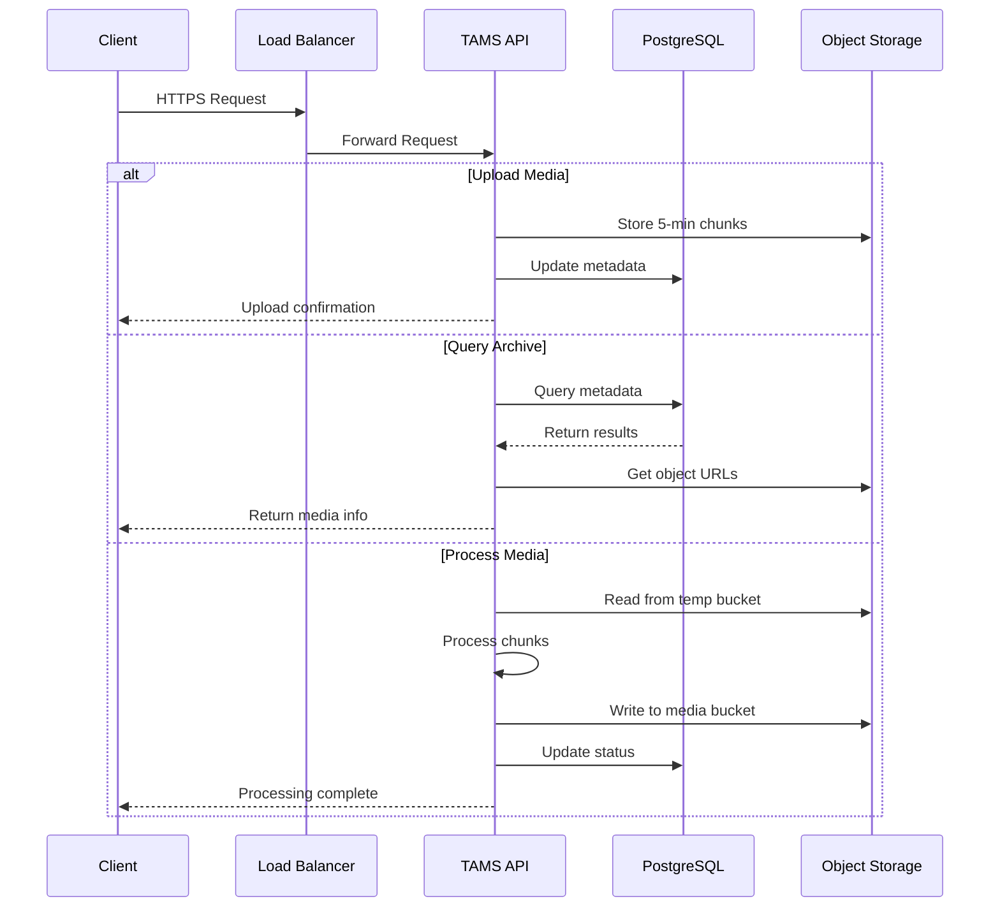

## Storage Architecture

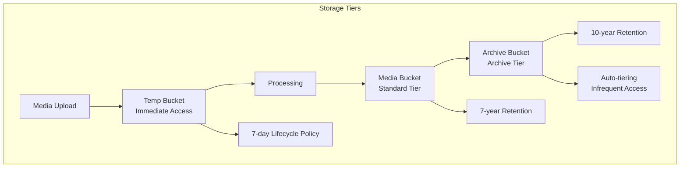

## Security Architecture

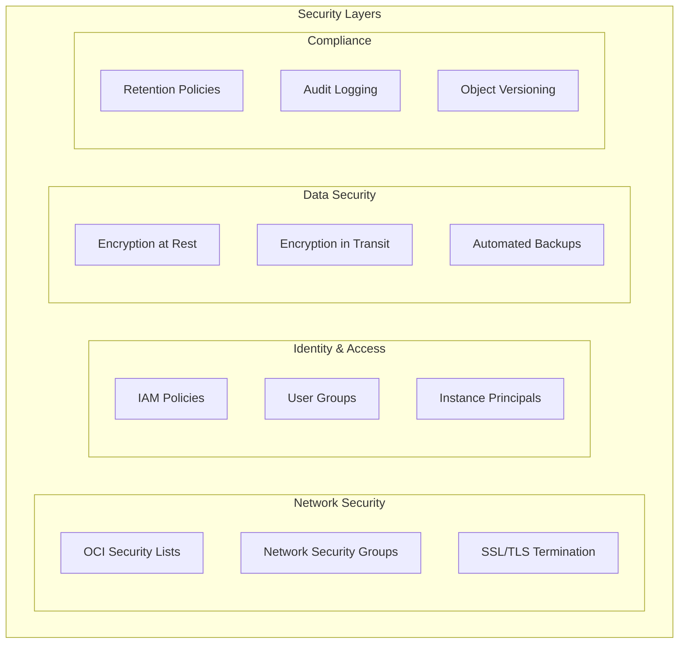

## Deployment Process

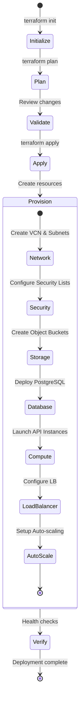

## Scaling Strategy

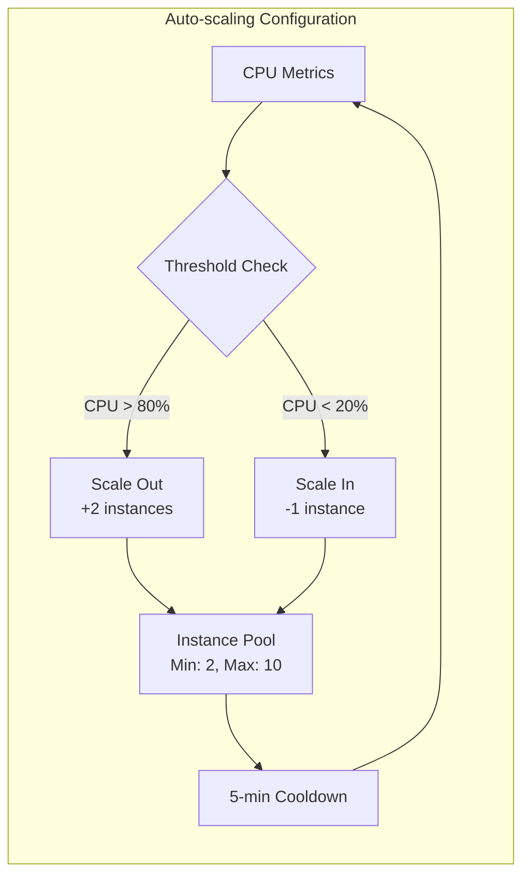

## Backup and Recovery

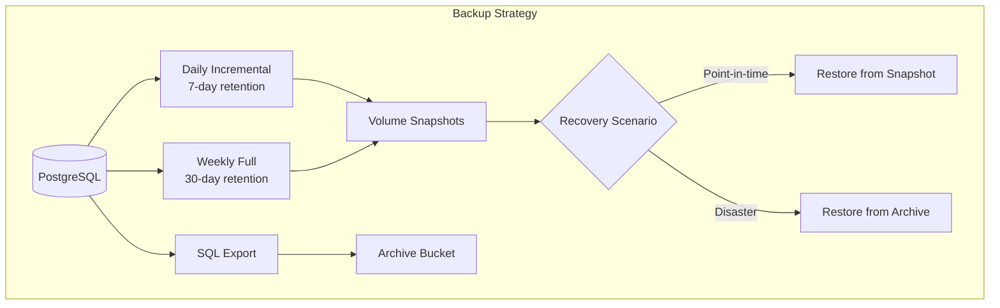

## Monitoring and Observability

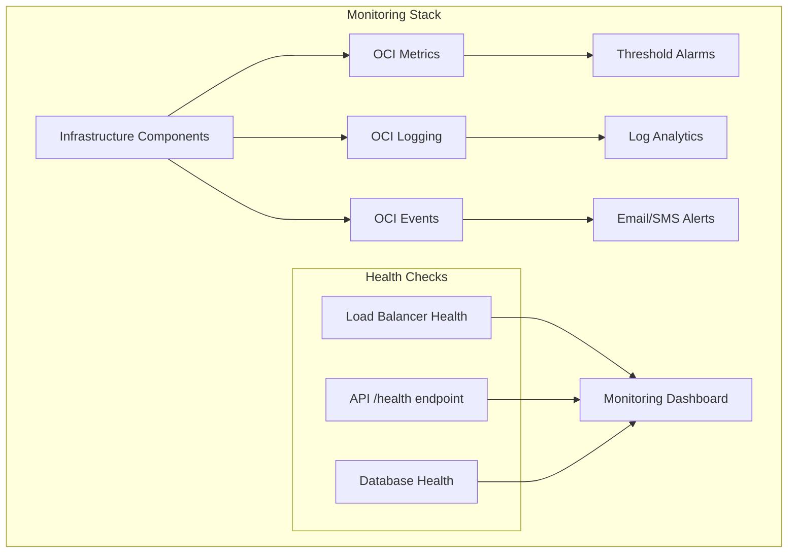

## Cost Optimization

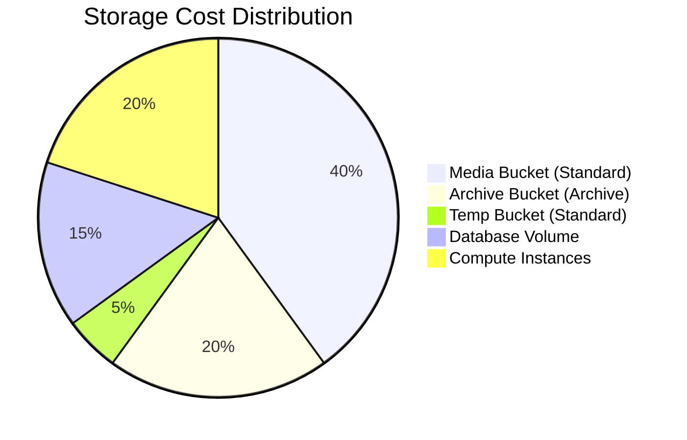

## Disaster Recovery Plan

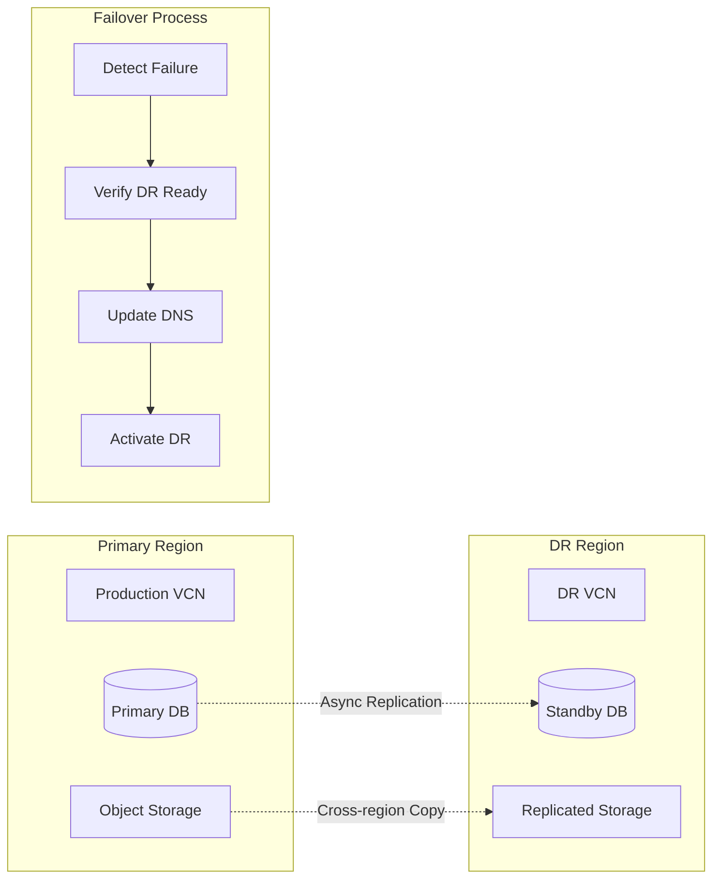

## Key Features

### High Availability
- Multi-instance API deployment behind load balancer
- Auto-scaling based on CPU metrics
- Database with automated backups

### Security
- Network isolation with private subnets
- SSL/TLS termination at load balancer
- IAM policies for resource access control
- Encryption at rest and in transit

### Scalability
- Horizontal scaling of API instances
- Object storage for unlimited media storage
- Flexible compute shapes

### Cost Optimization
- Archive tier for long-term storage
- Auto-tiering for infrequent access
- Lifecycle policies for temporary data

## Deployment Requirements

1. OCI Account with appropriate permissions
2. Configured OCI CLI or API keys
3. SSL certificates for HTTPS
4. SSH key pair for instance access
5. Terraform >= 1.0

## Maintenance Windows

- Database backups: Daily at 2 AM UTC
- System updates: Sunday 3 AM UTC
- Health checks: Every 5 minutes