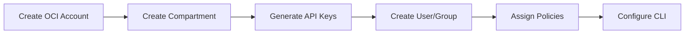
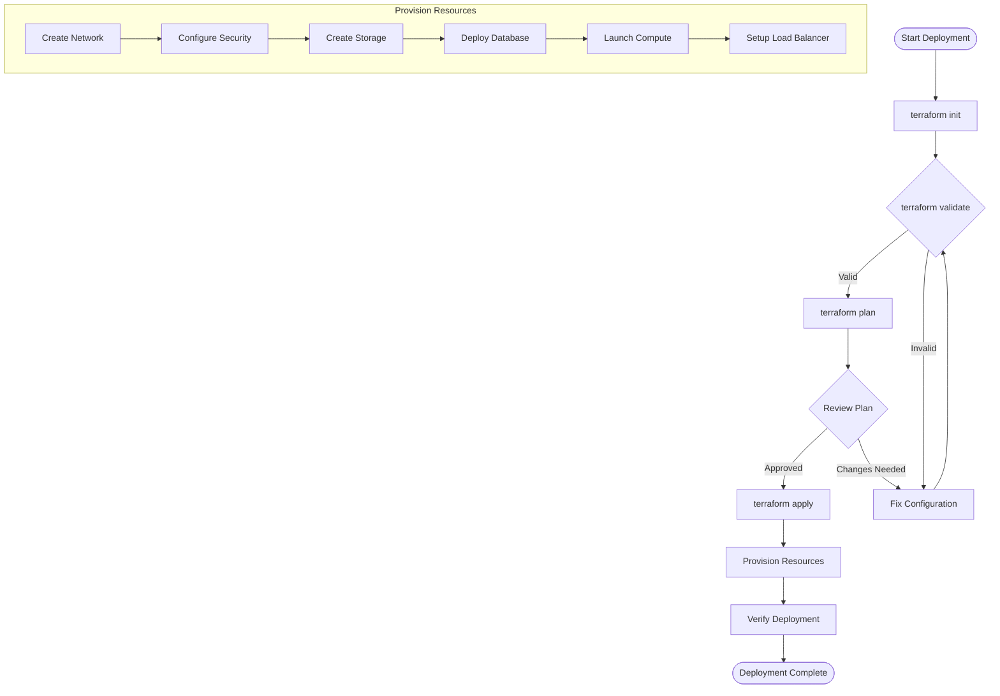
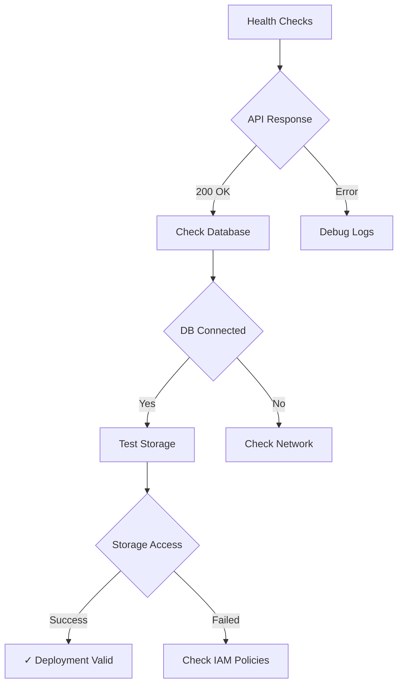
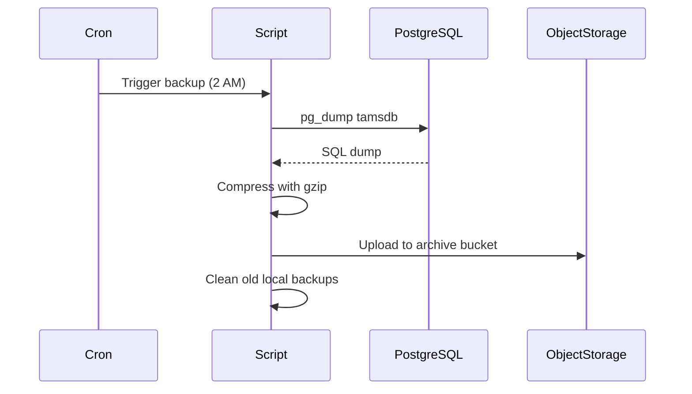
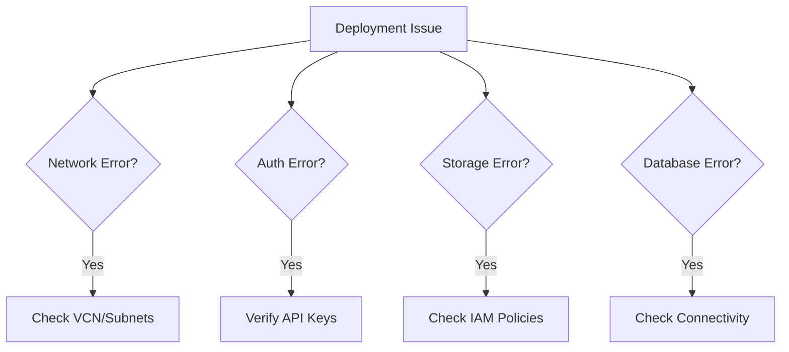

# TAMS OCI Deployment Guide

## Prerequisites

### 1. OCI Account Setup



### 2. Required Tools

- Terraform >= 1.0
- OCI CLI
- Git
- SSH client

### 3. API Key Configuration

```bash
# Generate API key pair
openssl genrsa -out ~/.oci/oci_api_key.pem 2048
openssl rsa -pubout -in ~/.oci/oci_api_key.pem -out ~/.oci/oci_api_key_public.pem

# Get fingerprint
openssl rsa -pubout -outform DER -in ~/.oci/oci_api_key.pem | openssl md5 -c
```

## Deployment Steps

### Step 1: Clone Repository

```bash
git clone <repository-url>
cd tams-oci
```

### Step 2: Configure Variables

```bash
# Copy example variables file
cp terraform.tfvars.example terraform.tfvars

# Edit with your OCI details
vim terraform.tfvars
```

### Step 3: Generate SSL Certificates

For testing:
```bash
cd certs/
openssl req -x509 -newkey rsa:4096 -keyout tams.key -out tams.crt -days 365 -nodes \
  -subj "/C=US/ST=State/L=City/O=Organization/CN=tams.example.com"
cd ..
```

### Step 4: Initialize Terraform

```bash
terraform init
```

### Step 5: Plan Deployment

```bash
terraform plan -out=tfplan
```

### Step 6: Apply Configuration

```bash
terraform apply tfplan
```

## Deployment Workflow



## Post-Deployment Configuration

### 1. Configure OCI CLI on Instances

```bash
# SSH to instance
ssh -i your-key.pem ubuntu@<instance-ip>

# Configure OCI CLI
oci setup config
```

### 2. Deploy TAMS Application

```bash
# Pull TAMS Docker image
docker pull your-registry/tams-api:latest

# Start application
cd /home/ubuntu/tams-api
docker-compose up -d
```

### 3. Configure DNS

Point your domain to the load balancer IP:
```bash
terraform output load_balancer_ip
```

### 4. Enable HTTPS with Let's Encrypt

```bash
# SSH to instances and run
sudo certbot --nginx -d your-domain.com
```

## Verification Steps



### Health Check Commands

```bash
# Check load balancer
curl -k https://$(terraform output load_balancer_ip)/health

# Check database connection
ssh ubuntu@<instance-ip> "sudo -u postgres psql -c '\l'"

# Check storage buckets
oci os bucket list --compartment-id $(terraform output compartment_id)
```

## Scaling Operations

### Manual Scaling

```bash
# Update instance count
terraform apply -var="api_instance_count=5"
```

### Auto-scaling Configuration

The auto-scaling is configured to:
- Scale out when CPU > 80%
- Scale in when CPU < 20%
- Maintain 2-10 instances

## Backup Procedures

### Database Backup



### Manual Backup

```bash
# SSH to database instance
ssh ubuntu@<db-instance-ip>

# Run backup script
sudo /usr/local/bin/backup_postgres.sh
```

## Monitoring Setup

### 1. Enable OCI Monitoring

```bash
# Create alarm for high CPU
oci monitoring alarm create \
  --display-name "High CPU Alert" \
  --compartment-id $COMPARTMENT_ID \
  --metric-compartment-id $COMPARTMENT_ID \
  --namespace "oci_computeagent" \
  --query "CpuUtilization[1m].mean() > 80" \
  --severity "CRITICAL"
```

### 2. Log Collection

```bash
# View application logs
ssh ubuntu@<instance-ip>
docker logs tams-api
tail -f /var/log/tams/api.log
```

## Troubleshooting

### Common Issues and Solutions



### Debug Commands

```bash
# Check terraform state
terraform state list
terraform state show <resource>

# Check OCI resources
oci compute instance list --compartment-id $COMPARTMENT_ID
oci network vcn list --compartment-id $COMPARTMENT_ID

# Check connectivity
nc -zv <database-ip> 5432
curl -v http://<api-instance-ip>:8080/health
```

## Cleanup

To destroy all resources:

```bash
# Destroy infrastructure
terraform destroy

# Confirm by typing 'yes'
```

## Security Best Practices

1. **Never commit sensitive data**
   - Use terraform.tfvars (gitignored)
   - Use OCI Vault for secrets

2. **Regular Updates**
   - Keep instances patched
   - Update container images

3. **Access Control**
   - Use principle of least privilege
   - Rotate API keys regularly

4. **Network Security**
   - Review security lists regularly
   - Use private subnets for sensitive resources

## Support and Maintenance

- Monitor health endpoints continuously
- Review logs daily
- Perform security updates monthly
- Test disaster recovery quarterly