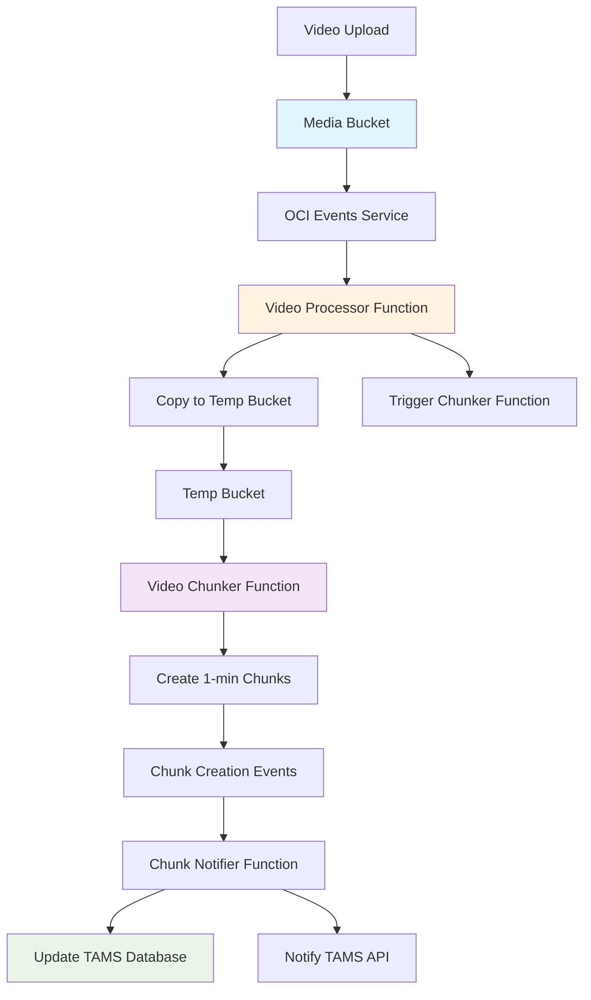
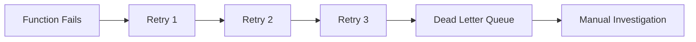
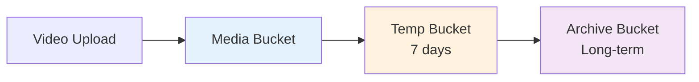

# Event-Driven Video Processing Pipeline

## Overview

TAMS implements a fully automated, event-driven video processing pipeline using OCI Functions, Events, and Object Storage. When a video is uploaded to the media bucket, it automatically triggers chunking processing.

## Architecture Flow



## Pipeline Components

### 1. Video Processor Function
**Trigger:** Object upload to `tams_media_bucket`
**Purpose:** Validate, copy, and initiate chunking

```go
// Event payload
{
  "eventType": "com.oraclecloud.objectstorage.object.create",
  "data": {
    "additionalDetails": {
      "bucketName": "tams-media-production",
      "objectName": "archive-tape-001.mp4",
      "objectSize": 1073741824
    }
  }
}
```

**Actions:**
1. Validate file is a video format
2. Copy from media bucket to temp bucket
3. Trigger video chunker function
4. Log processing status

### 2. Video Chunker Function
**Trigger:** HTTP call from video processor
**Purpose:** Split video into 1-minute chunks with scene detection

**Process:**
1. Download video from temp bucket
2. Run FFmpeg scene detection
3. Group scenes into ~60 second chunks
4. Split video at scene boundaries
5. Upload chunks back to temp bucket

### 3. Chunk Notifier Function
**Trigger:** Object creation in temp bucket (chunks/)
**Purpose:** Update database and notify TAMS API

**Actions:**
1. Parse chunk filename for metadata
2. Update TAMS database with chunk info
3. Notify TAMS API of completion
4. Handle error cases

## Event Configuration

### Events Rules

| Rule | Trigger | Target | Purpose |
|------|---------|---------|---------|
| `video-upload-rule` | Media bucket uploads | Video Processor | Start processing |
| `chunk-completion-rule` | Temp bucket chunks/ | Chunk Notifier | Track completion |

### Event Payloads

#### Object Storage Event
```json
{
  "eventType": "com.oraclecloud.objectstorage.object.create",
  "cloudEventsVersion": "0.1",
  "source": "ObjectStorage",
  "eventID": "unique-id",
  "eventTime": "2024-01-15T10:30:00Z",
  "data": {
    "compartmentId": "ocid1.compartment...",
    "compartmentName": "tams-compartment",
    "additionalDetails": {
      "bucketName": "tams-media-production",
      "objectName": "video-001.mp4",
      "namespace": "namespace",
      "objectSize": 1073741824,
      "eTag": "abc123...",
      "md5": "def456..."
    }
  }
}
```

## Function Specifications

### Video Processor
- **Memory:** 512 MB
- **Timeout:** 60 seconds
- **Trigger:** OCI Events (Object Storage)
- **Dependencies:** OCI Go SDK

### Video Chunker  
- **Memory:** 2048 MB
- **Timeout:** 300 seconds (5 minutes)
- **Trigger:** HTTP API call
- **Dependencies:** FFmpeg, Go standard library

### Chunk Notifier
- **Memory:** 256 MB  
- **Timeout:** 30 seconds
- **Trigger:** ONS (Object Notification Service)
- **Dependencies:** PostgreSQL driver

## Deployment Process

### Prerequisites
```bash
# Install Fn CLI
curl -LSs https://raw.githubusercontent.com/fnproject/cli/master/install | sh

# Configure OCI context
fn create context tams --provider oracle
fn use context tams
```

### Deploy Functions
```bash
# Deploy all functions
cd functions/video-processor && fn deploy --app tams-functions-app
cd ../video-chunker && fn deploy --app tams-functions-app  
cd ../chunk-notifier && fn deploy --app tams-functions-app

# Verify deployments
fn list functions tams-functions-app
```

### Test Pipeline
```bash
# Upload test video
oci os object put \
  --bucket-name tams-media-production \
  --file sample-video.mp4 \
  --name test-upload.mp4

# Monitor function logs
fn invoke tams-functions-app video-processor --display-name
```

## Monitoring and Observability

### Function Metrics
- **Invocation Count:** Number of function calls
- **Duration:** Processing time per function
- **Error Rate:** Failed invocations percentage
- **Concurrent Executions:** Parallel function runs

### Custom Metrics
```go
// In function code
log.Printf("METRIC video_size_bytes=%d processing_time_ms=%d", 
    videoSize, processingTime.Milliseconds())
```

### Alerts
- **Function Failures:** > 0 errors in 5 minutes
- **Long Processing:** > 4 minutes for video chunker
- **High Volume:** > 100 uploads per hour

### Logs Analysis
```bash
# View function logs
oci logging search-logs \
  --log-group-id ocid1.loggroup... \
  --time-start 2024-01-15T00:00:00Z \
  --time-end 2024-01-15T23:59:59Z
```

## Error Handling

### Retry Strategy


### Common Issues

| Issue | Cause | Solution |
|-------|-------|----------|
| Timeout | Large video files | Increase function timeout |
| Out of Memory | High-res videos | Increase memory allocation |
| Scene Detection Failed | Corrupted video | Add validation logic |
| Database Connection | Network issues | Add retry logic |

### Dead Letter Queue
Failed events are sent to OCI Streaming for manual processing:

```bash
# Process failed events
oci streaming message get \
  --stream-id ocid1.stream... \
  --cursor-type LATEST
```

## Performance Optimization

### Concurrent Processing
- Functions auto-scale based on demand
- Maximum 200 concurrent executions per function
- Cold start optimization with provisioned concurrency

### Cost Optimization
```bash
# Monitor function costs
oci usage-api usage-data summarize-usage \
  --granularity DAILY \
  --query-type COST \
  --tenant-id $TENANCY_OCID
```

### Storage Lifecycle


## Security Considerations

### IAM Policies
- Functions use Instance Principal authentication
- Minimum required permissions for each function
- Cross-bucket access controlled via policies

### Network Security  
- Functions run in private subnet
- No direct internet access
- Access to Object Storage via Service Gateway

### Data Protection
- All data encrypted at rest
- TLS for all API communications
- Audit logs for all operations

## Troubleshooting Guide

### Debug Mode
```bash
# Enable debug logging
export FN_DEBUG=true
fn invoke tams-functions-app video-processor --debug
```

### Common Commands
```bash
# Check function status
fn inspect function tams-functions-app video-processor

# View function logs
fn logs get tams-functions-app video-processor

# Update function configuration
fn update function tams-functions-app video-processor --memory 1024
```

### Health Checks
```bash
# Test function endpoints
curl -X POST https://api-gateway-url/tams/chunk-video \
  -H "Content-Type: application/json" \
  -d '{"video_url": "test-url"}'
```

## Integration with TAMS

### Database Schema Updates
```sql
-- Add chunk tracking table
CREATE TABLE chunks (
    chunk_id VARCHAR(255) PRIMARY KEY,
    asset_id VARCHAR(255) NOT NULL,
    sequence_number INTEGER,
    object_name VARCHAR(500),
    size BIGINT,
    status VARCHAR(50) DEFAULT 'processing',
    created_at TIMESTAMP DEFAULT NOW(),
    updated_at TIMESTAMP DEFAULT NOW()
);

-- Index for performance
CREATE INDEX idx_chunks_asset_id ON chunks(asset_id);
CREATE INDEX idx_chunks_status ON chunks(status);
```

### API Endpoints
```go
// Add to TAMS API
func chunkNotificationHandler(w http.ResponseWriter, r *http.Request) {
    var notification ChunkNotification
    json.NewDecoder(r.Body).Decode(&notification)
    
    // Update asset status
    updateAssetProgress(notification.AssetID, notification.ChunkID)
    
    w.WriteHeader(http.StatusOK)
}
```

This event-driven architecture ensures that TAMS automatically processes video uploads with minimal manual intervention, providing a scalable and reliable media processing pipeline.