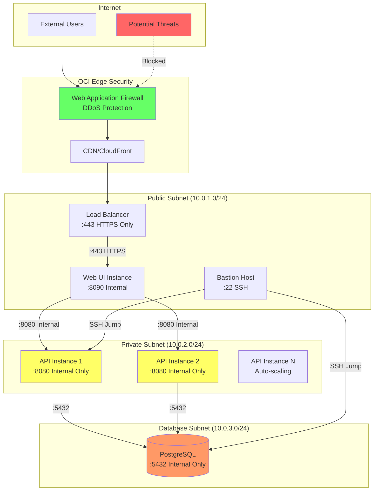
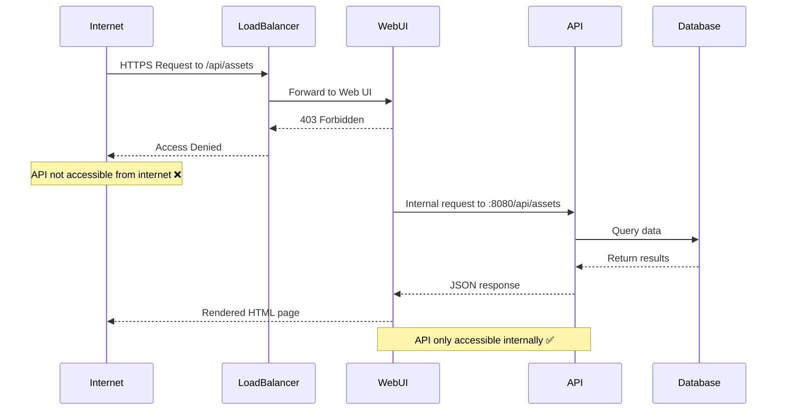
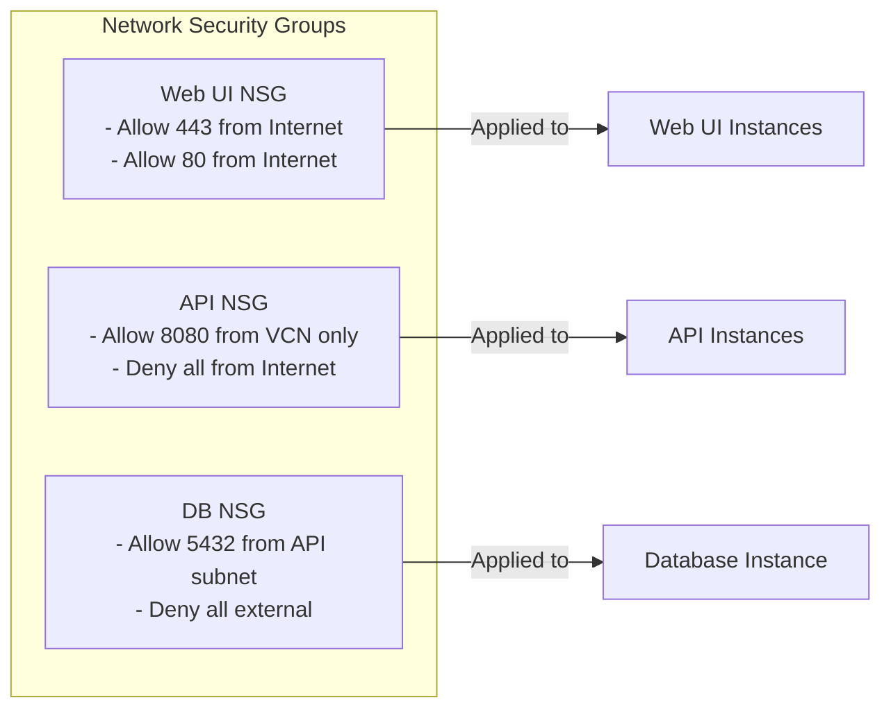

# TAMS Security Architecture

## Overview

The TAMS infrastructure implements defense-in-depth security with multiple layers of protection, ensuring the API is only accessible internally while the Web UI is securely exposed to the internet.

## Network Security Layers



## Security Configuration Details

### 1. Public Subnet Security (10.0.1.0/24)

#### Ingress Rules
| Port | Protocol | Source | Purpose | Security Notes |
|------|----------|---------|---------|----------------|
| 443 | TCP | 0.0.0.0/0 | HTTPS Web UI | SSL/TLS required |
| 80 | TCP | 0.0.0.0/0 | HTTP Redirect | Auto-redirect to HTTPS |
| 22 | TCP | 0.0.0.0/0 | SSH Admin | Should restrict to admin IPs |

#### Security Features
- ✅ SSL/TLS termination at load balancer
- ✅ HTTPS-only for production traffic
- ✅ Security headers (HSTS, CSP, X-Frame-Options)
- ✅ DDoS protection via OCI
- ⚠️ SSH should be restricted to known IPs

### 2. Private Subnet Security (10.0.2.0/24)

#### Ingress Rules
| Port | Protocol | Source | Purpose | Security Notes |
|------|----------|---------|---------|----------------|
| 8080 | TCP | 10.0.1.0/24 | API access from LB/WebUI | **INTERNAL ONLY** |
| 22 | TCP | 10.0.1.0/24 | SSH from bastion | Jump host required |
| ICMP | ICMP | 10.0.0.0/16 | Health checks | Internal monitoring |

#### Security Features
- ✅ **NO public IP addresses**
- ✅ **NO direct internet access**
- ✅ API accessible ONLY from VCN
- ✅ Outbound via NAT Gateway
- ✅ Network Security Groups enforce internal-only

### 3. Database Subnet Security (10.0.3.0/24)

#### Ingress Rules
| Port | Protocol | Source | Purpose | Security Notes |
|------|----------|---------|---------|----------------|
| 5432 | TCP | 10.0.2.0/24 | PostgreSQL from API | API subnet only |

#### Security Features
- ✅ Completely isolated subnet
- ✅ No internet access (ingress or egress)
- ✅ Only API instances can connect
- ✅ Encrypted backups to Object Storage

## API Protection Verification



## Security Rules Summary

### ✅ What IS Allowed:

1. **Public Internet Access:**
   - Web UI via HTTPS (port 443)
   - HTTP to HTTPS redirect (port 80)
   
2. **Internal Access:**
   - Web UI → API (internal port 8080)
   - API → Database (internal port 5432)
   - Bastion → All instances (SSH)

### ❌ What is BLOCKED:

1. **From Internet:**
   - Direct API access (port 8080) - **BLOCKED**
   - Direct database access - **BLOCKED**
   - Any non-HTTPS traffic - **BLOCKED**
   
2. **Network Isolation:**
   - API instances have NO public IPs
   - Database has NO public IP
   - Private subnets use NAT for outbound only

## Testing Security Configuration

### 1. Verify API is Internal-Only

```bash
# From Internet (should fail)
curl https://your-load-balancer-ip/api/v1/assets
# Result: 403 Forbidden or Connection Refused

# From Web UI instance (should work)
ssh ubuntu@webui-instance
curl http://10.0.2.x:8080/api/v1/assets
# Result: 200 OK with JSON data
```

### 2. Verify Web UI is Accessible

```bash
# From Internet (should work)
curl -k https://your-load-balancer-ip/
# Result: 200 OK with HTML

# Check security headers
curl -I https://your-load-balancer-ip/
# Should see: Strict-Transport-Security, X-Frame-Options, etc.
```

### 3. Port Scanning Test

```bash
# From Internet
nmap -Pn your-load-balancer-ip
# Should only show: 80/tcp, 443/tcp

# Should NOT show: 8080, 5432, 8090, etc.
```

## Network Security Groups



## Security Best Practices Implemented

### 1. Network Segmentation
- ✅ Three-tier architecture with isolated subnets
- ✅ Each tier has specific security rules
- ✅ Database in most restricted subnet

### 2. Access Control
- ✅ API not exposed to internet
- ✅ Web UI as the only public entry point
- ✅ Jump host (bastion) for administration

### 3. Encryption
- ✅ TLS 1.2+ for all HTTPS traffic
- ✅ Encrypted database connections
- ✅ Encrypted object storage

### 4. Security Headers
```nginx
Strict-Transport-Security: max-age=31536000
X-Frame-Options: SAMEORIGIN
X-Content-Type-Options: nosniff
Content-Security-Policy: default-src 'self'
```

### 5. Monitoring & Compliance
- ✅ Health checks every 5 minutes
- ✅ Audit logs enabled
- ✅ Backup encryption
- ✅ Principle of least privilege

## POC vs Production Recommendations

### Current POC Security (Implemented)
- ✅ API internal-only access
- ✅ HTTPS for Web UI
- ✅ Basic network segmentation
- ✅ Security headers
- ✅ Private subnets for API/DB

### Additional Production Security (Recommended)
- 🔒 Web Application Firewall (WAF)
- 🔒 API Gateway with rate limiting
- 🔒 OAuth2/OIDC authentication
- 🔒 Secrets management (OCI Vault)
- 🔒 Network flow logs
- 🔒 SIEM integration
- 🔒 Vulnerability scanning
- 🔒 Restrict SSH to specific IPs
- 🔒 Multi-factor authentication

## Security Validation Checklist

- [x] API instances have no public IPs
- [x] API port 8080 not accessible from internet
- [x] Database has no public IP
- [x] Web UI uses HTTPS only
- [x] Security headers configured
- [x] Network Security Groups in place
- [x] Private subnet routes through NAT
- [x] Load balancer handles SSL termination
- [x] API accessible only from within VCN
- [x] Backup encryption enabled

## Incident Response

In case of security concerns:

1. **Immediate Actions:**
   - Review security group rules
   - Check access logs
   - Verify no public IPs on private resources

2. **Investigation:**
   - Audit OCI flow logs
   - Review load balancer access logs
   - Check for unusual API access patterns

3. **Remediation:**
   - Update security rules if needed
   - Rotate credentials
   - Apply security patches

## Conclusion

The current configuration provides a **strong security baseline** for a POC/demo environment with:
- ✅ **API completely isolated** from internet access
- ✅ **Web UI securely exposed** via HTTPS only
- ✅ **Defense-in-depth** network architecture
- ✅ **Production-ready** security patterns

This setup successfully balances security requirements with demo accessibility, ensuring the TAMS API remains protected while allowing users to interact with the system through the secure Web UI.