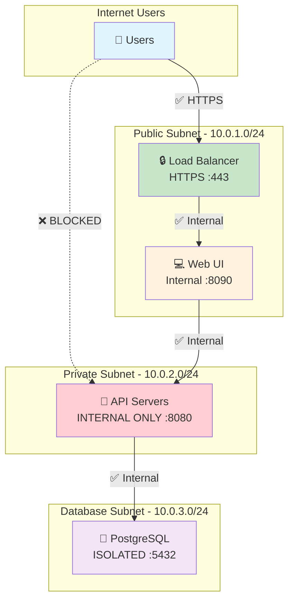

# TAMS Security Overview

## Quick Security Reference

The TAMS infrastructure implements a secure three-tier architecture with the API completely isolated from internet access while providing a secure web interface for users.

## Security Summary



## What's Protected

### ✅ Secure (Internet Accessible)
- **Web UI**: HTTPS-only access on port 443
- **Load Balancer**: SSL termination with security headers

### 🚫 Protected (Internal Only)
- **TAMS API**: Port 8080 blocked from internet
- **Database**: Port 5432 completely isolated
- **API Instances**: No public IP addresses

### 🔒 Security Features
- TLS 1.2+ encryption
- Security headers (HSTS, CSP)
- Network isolation
- Encrypted backups
- Health monitoring

## Access Patterns

### For End Users
```
User → HTTPS (443) → Load Balancer → Web UI → Beautiful Interface ✅
User → API (8080) → BLOCKED ❌
```

### For Applications  
```
Web UI → Internal Network → API (8080) → Database ✅
Internet → API (8080) → BLOCKED ❌
```

## Security Validation

### Test API is Blocked
```bash
# This should FAIL (good!)
curl https://your-load-balancer-ip/api/v1/assets
# Expected: 403 Forbidden or Connection refused
```

### Test Web UI Works  
```bash
# This should WORK
curl https://your-load-balancer-ip/
# Expected: 200 OK with HTML content
```

### Port Scan Test
```bash
nmap your-load-balancer-ip
# Should only show: 80/tcp, 443/tcp
# Should NOT show: 8080, 5432, 8090
```

## Network Security Rules

| Component | Port | Source | Access | Status |
|-----------|------|--------|--------|---------|
| Web UI | 443 | Internet | HTTPS | ✅ Allowed |
| Web UI | 80 | Internet | HTTP→HTTPS | ✅ Redirect |
| API | 8080 | Internet | Direct API | ❌ **BLOCKED** |
| API | 8080 | VCN Internal | Internal API | ✅ Allowed |
| Database | 5432 | API Subnet | Database | ✅ Allowed |
| SSH | 22 | Internet | Admin | ⚠️ Consider restricting |

## Security Architecture

For detailed security information, see:
- [Security Architecture](security-architecture.md) - Complete technical details
- [Deployment Guide](deployment-guide.md) - Secure deployment steps

## Key Security Benefits

1. **Zero Trust API**: API cannot be accessed from internet
2. **User-Friendly**: Secure web interface for all operations  
3. **Defense in Depth**: Multiple security layers
4. **Compliance Ready**: Audit logs and encryption
5. **POC Safe**: Secure enough for demos and testing

## Security Checklist

- [x] API has no public IP addresses
- [x] API port 8080 blocked from internet
- [x] Database completely isolated
- [x] Web UI uses HTTPS only
- [x] Security headers configured
- [x] Network segmentation implemented
- [x] TLS encryption enabled
- [x] Backup encryption enabled

## Quick Commands

```bash
# Deploy with security
terraform apply

# Check Web UI (should work)
curl -I https://$(terraform output -raw load_balancer_ip)

# Try API access (should fail)  
curl https://$(terraform output -raw load_balancer_ip)/api/v1/assets

# Access Web UI
open https://$(terraform output -raw web_ui_url)
```

## Production Recommendations

For production deployment, consider adding:
- Web Application Firewall (WAF)
- API Gateway with authentication  
- Restricted SSH access (specific IPs only)
- Secrets management (OCI Vault)
- Enhanced monitoring and alerting

---

**Result**: Users get a beautiful, secure web interface while the API remains completely protected from external access. Perfect balance of security and usability! 🎯